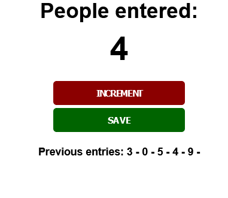

# passenger-counter-app
 
## Table of contents

  - [The challenge](#the-challenge)
  - [Screenshot](#screenshot)
  - [Links](#links)
  - [Author](#author)

### The challenge

Build a passenger counter app.

### Screenshot

### Links

- Solution URL: https://github.com/gdcristea/bored-bot

- Live Site URL: https://gdcristea.github.io/bored-bot/

## Author

- Linkedin - [Daniel Cristea](https://www.linkedin.com/in/daniel-cristea-629069191/)

- Frontend Mentor - [@gdcristea](https://www.frontendmentor.io/profile/gdcristea)

- Twitter - [@gdcristea10](https://twitter.com/gdcristea10)